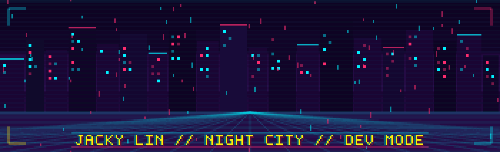

  

<h1 align="center">Jacky Lin</h1>

  <strong>Undergraduate researcher at Duke Kunshan University</strong> 
  Biophysics x molecular simulation x AI-assisted scientific workflows

  

  
  
  

  

## About Me

I am Jacky Lin, an undergraduate student at Duke Kunshan University interested in the quiet places where physics, biology, and computation begin to overlap. My work centers on molecular simulation, research automation, and AI-assisted tools that make scientific workflows more reproducible and readable.

I like building systems that help research move with more clarity: simulation folders that explain themselves, scripts that reduce manual friction, and document AI tools that turn dense PDFs into searchable knowledge. My long-term direction is toward medical physics, biomedical computation, and research software that feels precise enough for science and humane enough for daily use.

## Research Compass

| Direction | What I am exploring |
| --- | --- |
| Molecular dynamics | GROMACS workflows, CHARMM-GUI systems, reproducible simulation organization |
| Protein and ion selectivity | Lithium-ion selectivity, coordination environments, and analysis pipelines |
| DNA topology | Supercoiling-related questions and computational representations of structure |
| Biomedical AI | OCR, PDF extraction, local chatbot tools, and scientific document intelligence |
| Medical physics | Computational foundations for future graduate study and applied biomedical modeling |

## Toolkit

  
  
  
  
  
  
  
  
  
  

## Featured Work

| Project | What it means |
| --- | --- |
| [LiSPER](https://github.com/jackyissocute/LiSPER) | A molecular simulation and research workflow project around protein lithium-ion selectivity, computational discovery, and experiment-aware organization. |
| [LiSPER-BEADS](https://github.com/jackyissocute/LiSPER-BEADS) | Supporting work connected to LiSPER, with attention to molecular systems, project structure, and research artifacts. |
| [LiSPER-Dashboard](https://github.com/jackyissocute/LiSPER-Dashboard) | A dashboard-style interface for making LiSPER outputs easier to inspect and communicate. |
| [Supplier Document Intelligence](https://github.com/jackyissocute/supplier-doc-intelligence) | OCR, PDF extraction, and AI-assisted document processing inspired by an externship-style Pfizer project. |

## Current Focus

- Improving computational research workflows so simulation projects are easier to reproduce, review, and extend.
- Building Python and R analysis habits around molecular data, document data, and research notes.
- Studying molecular dynamics, molecular docking, and biomedical computation with a future medical physics path in mind.
- Using AI agents carefully: not as shortcuts for understanding, but as tools for documentation, coding support, and scientific organization.

## GitHub Snapshot

  
  

## Connect

  
  
  
  

  <em>"What I cannot create, I do not understand."</em> 
  — Richard Feynman

